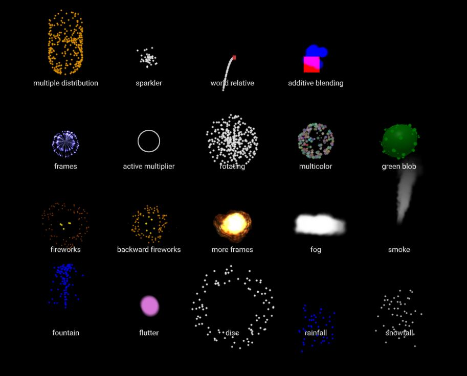

# aframe-spe-particles-component
The spe-particles component provides a wrapper around the [Shader Particle Engine by SquareFeet](http://squarefeet.github.io/ShaderParticleEngine/), for generating GPU based particle systems in A-Frame. The system supports single textures and spritesheets, settings for position, velocity, acceleration, color, opacity, rotation, size, drag and wiggle.

## [Demo](https://harlyq.github.io/aframe-spe-particles-component/)



## Example
```html
<head>
  <script src="https://aframe.io/releases/0.8.0/aframe.min.js"></script>
  <script src="https://unpkg.com/aframe-spe-particles-component@^1.0.4/dist/aframe-spe-particles-component.min.js"></script>
</head>

<body>
  <a-entity particles="texture: /assets/blob.png; color: blue; velocity: 0 10 0; velocity-spread: 2 0 2; acceleration: 0 -10 0"></a-entity>
</body>
```
## Value
| Property | Description | Default Value | Type |
| -------- | ----------- | ------------- | ---- |
|acceleration|for sphere and disc distributions, only the x axis is used|{x: 0, y: 0, z: 0}|vec3|
|acceleration-distribution|distribution of particle acceleration, for disc and sphere, only the x component will be used. if set to NONE use the 'distribution' attribute for accelerationDistribution|'NONE'|['NONE', 'BOX', 'SPHERE', 'DISC']|
|acceleration-spread|spread of the particle's acceleration. for sphere and disc distributions, only the x axis is used|{x: 0, y: 0, z: 0}|vec3|
|active-multiplier|multiply the rate of particles emission, if larger than 1 then the particles will be emitted in bursts. note, very large numbers will emit all particles at once|1|number|
|affected-by-fog|if true, the particles are affected by THREE js fog|true|boolean|
|alpha-test|alpha values below the alphaTest threshold are considered invisible|0|number|
|angle|2D rotation of the particle over the particle's lifetime, max 4 elements|[0]|array|
|angle-spread|spread in angle over the particle's lifetime, max 4 elements|[0]|array|
|blending|blending mode, when drawing particles|'normal'|['no', 'normal', 'additive', 'subtractive', 'multiply', 'custom']|
|color|array of colors over the particle's lifetime, max 4 elements|['#fff']|array|
|color-spread|spread to apply to colors, spread an array of vec3 (r g b) with 0 for no spread. note the spread will be re-applied through-out the lifetime of the particle|[]|array|
|depth-test|if true, don't render a particle's pixels if something is closer in the depth buffer|true|boolean|
|depth-write|if true, particles write their depth into the depth buffer. this should be false if we use transparent particles|false|boolean|
|direction|make the emitter operate forward or backward in time|'forward'|['forward', 'backward']|
|distribution|distribution for particle positions, velocities and acceleration. will be overriden by specific '...Distribution' attributes|'BOX'|['BOX', 'SPHERE', 'DISC']|
|drag|apply resistance to moving the particle, 0 is no resistance, 1 is full resistance, particle will stop moving at half of it's maxAge|0|number|
|drag-spread|spread to apply to the drag attribute|0|number|
|duration|duration of the emitter (seconds), if less than 0 then continuously emit particles|-1|number|
|emitter-scale|global scaling factor for all particles from the emitter|100|number|
|enable-in-editor|enable the emitter while the editor is active (i.e. while scene is paused)|false|boolean|
|enabled|enable/disable the emitter|true|boolean|
|frustum-culled|enable/disable frustum culling|false|boolean|
|has-perspective|if true, particles will be larger the closer they are to the camera|true|boolean|
|max-age|maximum age of a particle before reusing|1|number|
|max-age-spread|variance for the 'maxAge' attribute|0|number|
|opacity|opacity over the particle's lifetime, max 4 elements|[1]|array|
|opacity-spread|spread in opacity over the particle's lifetime, max 4 elements|[0]|array|
|particle-count|maximum number of particles for this emitter|100|int|
|position-distribution|distribution of particle positions, disc and sphere will use the radius attributes. For box particles emit at 0,0,0, for sphere they emit on the surface of the sphere and for disc on the edge of a 2D disc on the XY plane|'NONE'|['NONE', 'BOX', 'SPHERE', 'DISC']|
|position-offset|fixed offset to the apply to the emitter relative to its parent entity|{x: 0, y: 0, z: 0}|vec3|
|position-spread|particles are positioned within +- of these local bounds. for sphere and disc distributions only the x axis is used|{x: 0, y: 0, z: 0}|vec3|
|radius|radius of the disc or sphere emitter (ignored for box). note radius of 0 will prevent velocity and acceleration if they use a sphere or disc distribution|1|number|
|radius-scale|scales the emitter for sphere and disc shapes to form oblongs and ellipses|{x: 1, y: 1, z: 1}|vec3|
|randomize-acceleration|if true, re-randomize acceleration when re-spawning a particle, can incur a performance hit|false|boolean|
|randomize-angle|if true, re-randomize angle when re-spawning a particle, can incur a performance hit|false|boolean|
|randomize-color|if true, re-randomize colour when re-spawning a particle, can incur a performance hit|false|boolean|
|randomize-drag|if true, re-randomize drag when re-spawning a particle, can incur a performance hit|false|boolean|
|randomize-opacity|if true, re-randomize opacity when re-spawning a particle, can incur a performance hit|false|boolean|
|randomize-position|if true, re-randomize position when re-spawning a particle, can incur a performance hit|false|boolean|
|randomize-rotation|if true, re-randomize rotation when re-spawning a particle, can incur a performance hit|false|boolean|
|randomize-size|if true, re-randomize size when re-spawning a particle, can incur a performance hit|false|boolean|
|randomize-velocity|if true, re-randomize velocity when re-spawning a particle, can incur a performance hit|false|boolean|
|relative|world relative particles move relative to the world, while local particles move relative to the emitter (i.e. if the emitter moves, all particles move with it)|'local'|['local', 'world']|
|rotation|rotation in degrees|0|number|
|rotation-axis|local axis when using rotation|{x: 0, y: 0, z: 0}|vec3|
|rotation-axis-spread|variance in the axis of rotation|{x: 0, y: 0, z: 0}|vec3|
|rotation-spread|rotation variance in degrees|0|number|
|rotation-static|if true, the particles are fixed at their initial rotation value. if false, the particle will rotate from 0 to the 'rotation' value|false|boolean|
|size|array of sizes over the particle's lifetime, max 4 elements|[1]|array|
|size-spread|spread in size over the particle's lifetime, max 4 elements|[0]|array|
|texture|texture to be used for each particle, may be a spritesheet||map|
|texture-frame-count|number of frames in the spritesheet, negative numbers default to textureFrames.x * textureFrames.y|-1|int|
|texture-frame-loop|number of times the spritesheet should be looped over the lifetime of a particle|1|int|
|texture-frames|x and y frames for a spritesheet. each particle will transition through every frame of the spritesheet over its lifetime (see textureFramesLoop)|{x: 1, y: 1}|vec2|
|use-transparency|should the particles be rendered with transparency?|true|boolean|
|velocity|for sphere and disc distributions, only the x axis is used|{x: 0, y: 0, z: 0}|vec3|
|velocity-distribution|distribution of particle velocities, for disc and sphere, only the x component will be used. if set to NONE use the 'distribution' attribute for velocityDistribution|'NONE'|['NONE', 'BOX', 'SPHERE', 'DISC']|
|velocity-spread|variance for the velocity|{x: 0, y: 0, z: 0}|vec3|
|wiggle|extra distance the particle moves over its lifetime|0|number|
|wiggle-spread|+- spread for the wiggle attribute|0|number|

## Limitations
When using the disc or sphere distributions for velocity or acceleration, setting the radius to 0, will also disable the velocity and acceleration

Enabling **randomizePosition** on sphere or disc distributions breaks the velocity and acceleration behavior

Having an **activeMultiplier** greater than 1 provides a burst of particles, however the emitter will gradually get out of sync and emit more and more particles between each burst

On Firefox when using a single particle with an infinite duration emitter, the particle may disappear

If the **duration** is the same as **maxAge**, then particles may be emitted at the end of the duration

If a **texture** is not provided then a 1x1 white texture will be used